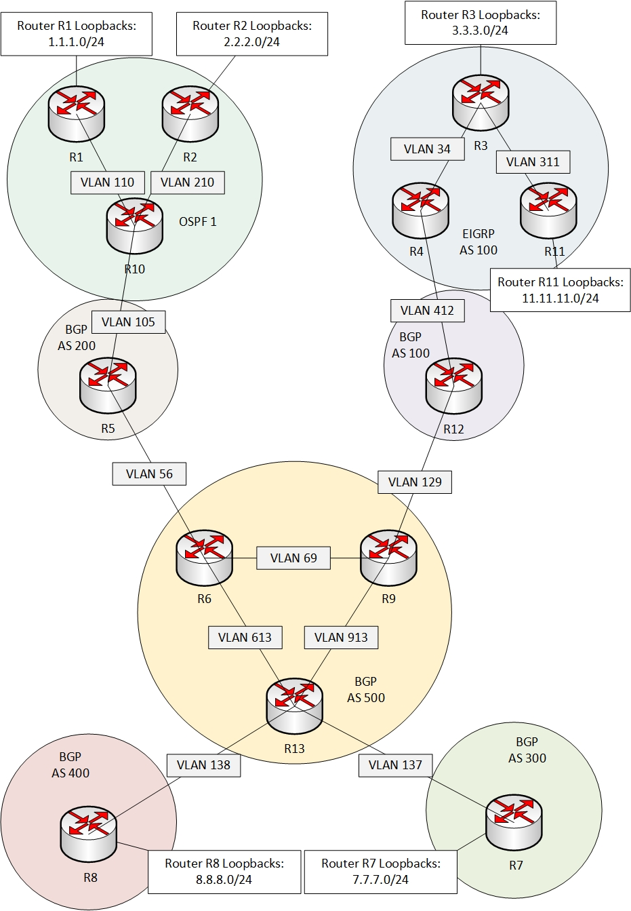
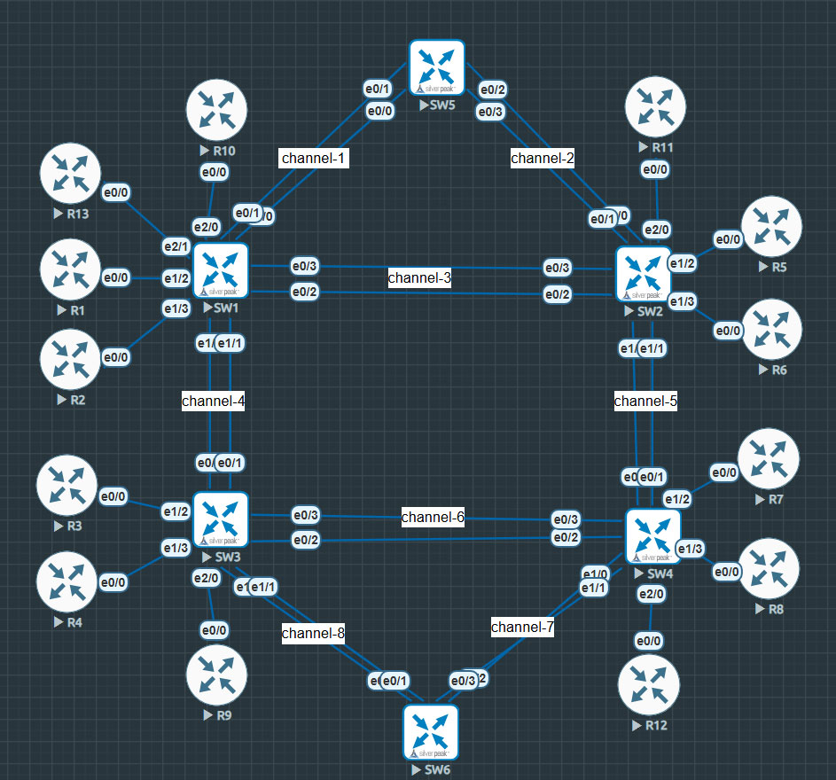

# Multi-Protocol Routing Lab (CCNP-Level)

این سناریو برای تمرین پروتکل‌های مختلف مسیریابی طراحی شده و در محیط **EVE-NG** پیاده‌سازی شده است.  
پروژه شامل پیاده‌سازی پروتکل‌های **OSPF، EIGRP، BGP** و همچنین پیاده‌سازی یک **Access-List** هدفمند است.

---

## 🧠 خلاصه سناریو

- ارتباط کامل بین همه روترها از طریق پروتکل‌های روتینگ برقرار است.
- تمامی Loopback ها از طریق روتینگ قابل دسترسی هستند.
- فقط از طریق ACL، آدرس `8.8.8.8` (R8) نمی‌تواند `11.11.11.11` (R11) را پینگ کند.
- توپولوژی فیزیکی و منطقی ضمیمه شده‌اند.

---

## 🧩 توپولوژی‌ها

### 🔷 توپولوژی منطقی (Logical)


### 🔶 توپولوژی فیزیکی (Physical)


---

## 📁 ساختار فایل‌ها

```
multi-protocol-lab/
├── README.md               ← توضیح کلی پروژه
├── topology-logical.jpg    ← نقشه منطقی
├── topology-physical.jpg   ← نقشه فیزیکی
├── configs/                ← فایل‌های کانفیگ تمام تجهیزات
```

---

## 📌 ابزارهای استفاده‌شده

- **EVE-NG** (Community Edition)
- **Cisco IOSvL3** & **IOSvL2**
- دستورات `show run` برای گرفتن خروجی کانفیگ‌ها
- فایل‌ها در قالب GitHub-Ready ساختاردهی شده‌اند

---

## 👨‍💻 نویسنده

**Amir Mohammad Zare Zadeh**  
🔗 سایت شخصی: [amzarezadeh.ir](https://amzarezadeh.ir)  
📘 آموزش وردپرس: [wp-learning.ir](https://wp-learning.ir)  
📧 تماس: info@amzarezadeh.ir

---

## 🎥 ویدیوی معرفی سناریو
- [تماشا در آپارات](https://www.aparat.com/v/jbe94mh)  
- [تماشا در یوتیوب](https://youtu.be/3VVDIBSxgYs?si=5DhXCeKEJ4mxrHFn)

---
## ✅ وضعیت پروژه

✔️ تکمیل‌شده – آماده اشتراک‌گذاری در گیت‌هاب  
📎 جهت تمرین، آموزش، یا مرجع شخصی
